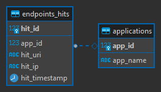
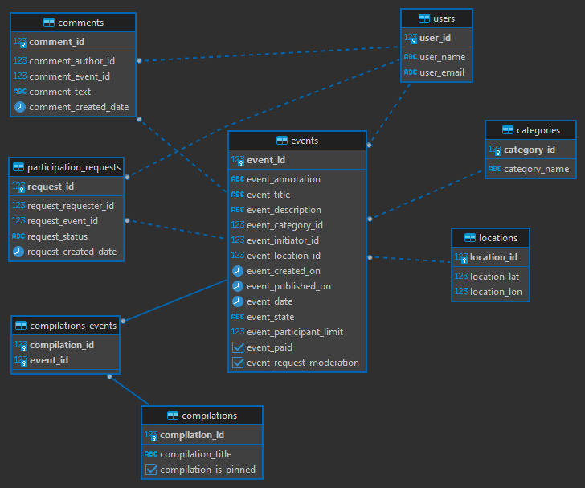

# java-explore-with-me
_Приложение ExploreWithMe (англ. «исследуй со мной»). Оно позволит пользователям делиться информацией об 
интересных событиях и находить компанию для участия в них._

### Pull Request

  
Сервис статистики
 

1. Запись информации о том, что был обработан запрос к эндпоинту API;
2. Предоставление статистики за выбранные даты по выбранному эндпоинту;

  
Основной сервис
 

1. Реализация основной логики приложения;
2. Публичный API предоставляет возможности поиска и фильтрации событий;
3. Закрытая часть API реализует возможности зарегистрированных пользователей продукта;
4. Административная часть API должна предоставляет возможности настройки и поддержки работы сервиса;

  
Комментарии
 

1. Возможность оставлять комментарии к событиям и модерировать их;

### [Спецификация основного сервиса](ewm-main-service-spec.json) 
### [Спецификация сервиса статистики](ewm-stats-service-spec.json)

### ER диаграмма базы данных сервиса статистики

### ER диаграмма базы данных основного сервиса

